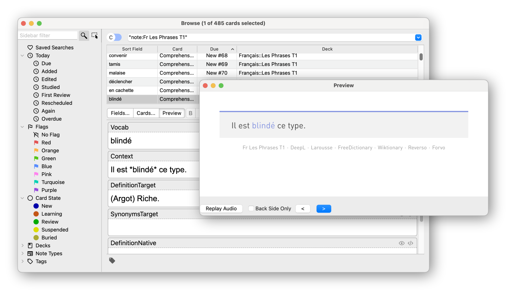

# AnkiMarker

Add custom Markdown-like highlighting to your Anki cards!

<!-- TODO: Add example images. -->

## Installation

Download and run the latest [`AnkiMarker.ankiaddon`][releases] release.

## Usage

### Configuration

Markers are defined in two different files: `markers.json` and `markers.css`.
The `markers.json` file defines the markers' name, markup and their classes.
The `markers.css` file defines how the markers' style. Both files can be
found within the add-on's `user_files` folder:

```plaintext
addons21/AnkiMarker
├── src/
└── user_files
    ├── markers.css
    └── markers.json
```

#### `markers.json`

The default `markers.json` defines a single marker named `Accent` with a markup
of `*` and a class name of `accent`. This would convert the string `*abc*` to
`<marker class="accent">abc</marker>`.

```json
{
    "parent-class": "",
    "markers": [
        {
            "name": "Accent",
            "markup": "*",
            "classname": "accent"
        }
    ]
}
```

#### `markers.css`

The default `markers.css` file defines the style of the `Accent` marker. To
properly connect it to its JSON counterpart, we must make sure the `classname`
is used within the CSS selector. To do so, we can use `marker.accent` or simply
`.accent` as its CSS selector.

```css
/**
 * User defined CSS
 */

marker.accent {
    /**
     * accent
     * *abc*
     * <marker class="accent">abc</marker>
     */

    color: hsla(230, 60%, 70%, 1);
    font-style: unset;
    font-weight: 400;
    text-decoration: unset;
    background-color: unset;
}
```

### Templates and Field Filters

Assuming we have a field named `Expression`, and the `accent` marker defined
above, we can convert our input string into two different forms, `marked`
and `unmarked`, by using field filters. A `marked` filter converts the string
into its HTML equivalent while an `unmarked` filter strips all the markup.
For example, if we start with the string `Il est *blindé* ce type.`, we can
have one of three output strings based on the syntax we use when calling the
`Expression` field

| Filter     | Field Syntax              | Resulting String                                         |
| ---------- | ------------------------- | -------------------------------------------------------- |
| -          | `{{Expression}}`          | `Il est *blindé* ce type.`                               |
| `marked`   | `{{marked:Expression}}`   | `Il est <marker class="accent">blindé</marker> ce type.` |
| `unmarked` | `{{unmarked:Expression}}` | `Il est blindé ce type.`                                 |



## Development

1. Install the required `[python-version]`. See the [Anki development][anki-dev]
   docs for more information.

    ```shell
    pyenv install [python-version]
    ```

2. Clone this repository.

    ```shell
    git clone git@github.com:tnahs/AnkiMarker.git
    ```

3. Set `[python-version]` as the local version:

    ```shell
    cd ./AnkiMarker
    pyenv local [python-version]
    ```

4. Create and enter a virtual environment:

    ```shell
    python -m venv .venv
    source .venv/bin/activate
    pip install --upgrade pip
    ```

5. Install required packages:

    ```shell
    pip install -r requirements.txt
    ```

6. Set development environment variables. See
   [Anki development | Environment Variables][env-var] for more information.

    Required:

    ```shell
    export ANKI_ADDON_DEVELOPMENT=1
    ```

    Optional:

    ```shell
    export ANKIDEV=1
    export LOGTERM=1
    export DISABLE_QT5_COMPAT=1
    ```

7. Run Anki from the terminal.

    ```shell
    anki
    ```

[anki-dev]: https://github.com/ankitects/anki/blob/main/docs/development.md
[env-var]: https://github.com/ankitects/anki/blob/main/docs/development.md#environmental-variables
[releases]: https://github.com/tnahs/AnkiMarker/releases
